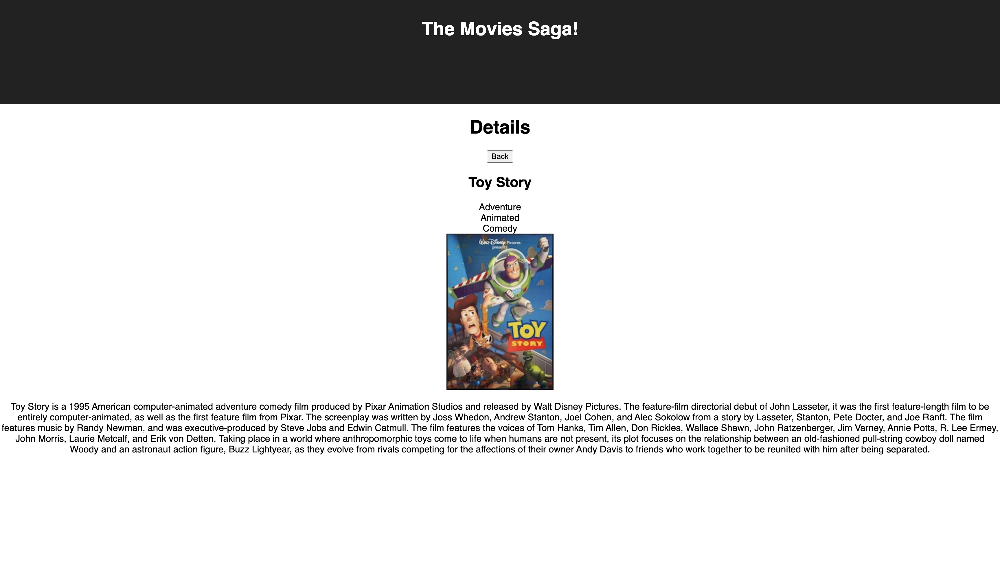

# Movies-Saga

[Project Instructions](./INSTRUCTIONS.md), this line may be removed once you have updated the README.md

## Description

For this project we practiced using Redux-Saga and table joins to display movie details and the corresponding genres that apply to the appropriate movie. Movies and genres are two tables so we learned about many-to-many joins to get the correct genres for the clicked movie.

### Project Goals

* When a movie poster is clicked, a user should be brought to the `/details` view for that movie.
* Details page should show all details **including ALL genres** for the selected movie, including title, description, and the image, too! Use Sagas and Redux to handle these requests and data.
* The details page should have a `Back to List` button, which should bring the user to the Home/List Page